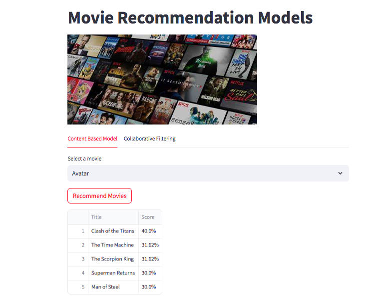

# Movie Reccommendation App

Welcome to **Movie Recommendation App.** This project was made for estimate which movie or movies can a user should watch depending on two recommendation models:
* Content Based System: which chooses one or more movies to the user deppending on some features of the movie, like genres, cast, director and overview.
* Collaborative Filtering: suggest same one o more movies but deppending on the user's score on each movie he/she has watched.
  
(Click on the image below to go to the app website.)
 
  

